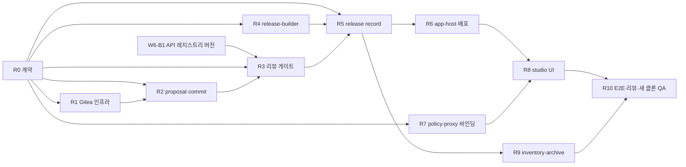

# P1-1 설계: Git 연결 → PR 리뷰 → immutable release → 배포·rollback

작성일: 2026-09-14. 대상은 [`TOSS-GAP.md`](compare/TOSS-GAP.md) §5의 P1-1(격차 E2~E5), [`INTENT`](../intent/INTENT.md)의 "라이브 어드민 역추적"·열린 질문 #8, [`FOLLOWUPS`](FOLLOWUPS.md)의 INTENT #8(archive)이다. 이 문서는 **설계만** 담는다. 코드·계약은 바꾸지 않았다.

**출처 경계.** 토스가 공개한 것은 "소스 S3 갱신·Git 연결·PR 리뷰·라이브 앱 존재"까지다(TOSS-GAP §6). repo 소유 방식, PR 필수 여부, CODEOWNERS, 배포 target·pipeline·rollback은 비공개이므로 아래 내용은 모두 **이 저장소를 위한 우리 설계**이며 토스 구현을 서술하지 않는다.

**현재 상태.** 소스는 agent-server 로컬 JSON에 최신본만 있다(`services/agent-server/src/store.ts`의 `save`는 이전 revision을 덮어쓴다). `Project`는 `revision`만 가진다(`contracts/src/generation.ts`). `sourceDigest`(정규화 경로 + canonical JSON의 sha256, `digest.ts`)는 이미 있다. 권한은 Keycloak + 프로젝트 역할 + live 쓰기 4-eyes `Approval`(`contracts/src/auth.ts`), 감사는 해시 체인 + 외부 앵커(`contracts/src/policy.ts`)다. release·배포·Git 연동은 없다.

**설계 원칙.**
1. 신뢰 원점은 플랫폼이다. Git 호스팅(forge)의 승인·보호 규칙은 2차 방어선이고, 병합·release·배포 판정은 플랫폼이 다시 검증한다.
2. release는 한 번 만들면 바뀌지 않는다. 배포와 rollback은 release를 가리키는 **포인터 이동**이다.
3. 생성 코드는 자기 리뷰 조건(CODEOWNERS, API 사용 선언)을 바꿀 수 없다.
4. 기존 경계를 약화하지 않는다: 프록시 강제, 앱 코드에 토큰 없음(R3-M2 교훈), 레지스트리 자격증명은 deps-builder에만, live 쓰기 4-eyes.
5. 화면 rollback은 API 쓰기 rollback이 아니다. 이 사실을 UI·API·감사에 드러낸다.

---

## 1. source revision ↔ Git commit 매핑

### 1.1 repo 소유 방식 비교

| 기준 | A. 플랫폼 소유 repo (앱당 1 repo, 플랫폼 org) | B. 사용자 repo 연결 | C. 둘 다 |
|---|---|---|---|
| 쓰기 주체 | 플랫폼 bot만 push. 사람은 PR 리뷰만 | 사용자와 플랫폼이 함께 push | 앱마다 다름 |
| 소스 원천 | 플랫폼 revision이 원천, Git은 복제본 | 원천이 둘 → 양방향 동기화·충돌 해결 필요(E7 GitOps 수준) | 두 모델을 모두 유지 |
| CODEOWNERS·보호 규칙 | 플랫폼이 생성·고정 | 사용자 repo 설정에 의존. 보호 규칙이 약하면 우회 가능 | 앱마다 검증 경로가 다름 |
| 권한 | bot 설치 1곳, 최소 권한 | repo마다 앱 설치·권한 위임, 토큰 범위 관리 | 합 |
| provenance | commit tree에서 `sourceDigest`를 재계산해 결정적으로 검증 | 외부 commit이 섞여 revision과 1:1이 깨짐 | — |
| 기존 repo 이관(E8) | 불가(별도 import 필요) | 자연스러움 | 가능 |
| 규모 | M | L(동기화·충돌) | L+ |

**추천: A를 P1-1 범위로 한다. B는 P2-1(MCP·GitOps·기존 repo 이관)로 미룬다.** A는 "revision → commit"을 단방향·결정적으로 만들 수 있어 immutable release의 provenance가 단순해진다. B의 핵심 난제(외부 push와 플랫폼 revision의 충돌)는 E7과 같은 문제라 P2-1에서 한 번에 푸는 편이 낫다. A의 데이터 모델(`SourceCommit`)은 B에서도 그대로 쓸 수 있게 `origin: "platform"` 필드를 둔다.

### 1.2 매핑 규칙 (A)

- **모든 revision이 commit이 되지는 않는다.** 채팅 생성·자동 저장 revision은 플랫폼 내부 이력으로만 남는다. 사용자가 "리뷰 요청"(proposal)을 할 때 그 revision을 commit한다. 이유: 채팅 한 번에 revision이 여러 개 생기므로 commit 폭증과 리뷰 소음을 막는다.
- **branch:** `toi/rev-<revision>`에 commit, 대상은 `main`. `main`은 플랫폼 병합으로만 갱신한다.
- **commit 내용:** project VFS 파일 전부 + 플랫폼 생성 파일 `.toi/package-set.json`, `.toi/api-usage.json`, `.toi/CODEOWNERS`(→ `CODEOWNERS`로 복사). 파일 경로는 `normalizePath` 결과에서 앞의 `/`를 뗀 것.
- **commit trailer:** `Toi-Project: <projectId>`, `Toi-Revision: <n>`, `Toi-Source-Digest: <sha256>`, `Toi-Proposal: <proposalId>`. 작성자는 bot, `Co-authored-by`에 제안자(Keycloak username). trailer는 사람이 읽기 위한 것이고 검증은 매핑 레코드로 한다.
- **매핑 레코드**(플랫폼 저장, append-only):
  ```ts
  interface SourceCommit {
    projectId: string; revision: number; sourceDigest: string;
    repo: string; branch: string; commitSha: string;
    origin: "platform";           // B 도입 시 "external" 추가
    createdBy: string; createdAt: string;
  }
  ```
- **검증:** `commitSha`의 tree에서 `.toi/*`와 `CODEOWNERS`를 제외한 파일로 `sourceDigest`를 재계산해 레코드·trailer와 비교한다. 다르면 proposal·release 모두 거부.
- **Git 쪽 직접 수정:** 사람이 `toi/*`나 `main`에 push하는 것은 forge 보호 규칙으로 막는다(bot만 허용). 그래도 들어온 commit은 매핑 레코드가 없으므로 병합 게이트(§2)와 release 검증(§3)에서 거부된다. 리뷰 코멘트에 따른 수정은 플랫폼(채팅·에디터)에서 새 revision → 같은 PR에 새 commit으로 반영한다.
- **revision 이력 전제:** proposal 시점에 해당 revision의 파일이 필요하다. 현재 store는 최신본만 두므로 `SourceSnapshotStore`(§6) 인터페이스가 선행돼야 한다. proposal은 `revision === current.revision`일 때만 허용하는 최소 구현으로 시작할 수 있다.

### 1.3 로컬 재현: Gitea

| 후보 | PR·리뷰 | 보호 규칙·필수 승인 | Keycloak(OIDC) 로그인 | webhook·API | 판단 |
|---|---|---|---|---|---|
| Gitea (Docker `gitea/gitea`) | 있음 | branch protection, 승인 수, 승인자 whitelist, stale 승인 무효화 | OAuth2/OIDC 인증 소스 | 있음(HMAC 서명) | **추천** |
| Forgejo (Gitea 포크) | 동일 계열 | 동일 계열 | 있음 | 있음 | 라이선스·커뮤니티 선호 시 대체 |
| bare git + 스튜디오 자체 리뷰 | 직접 구현 | 직접 구현 | 기존 그대로 | 없음 | 가볍지만 "Git PR 리뷰" 재현이 아님 |
| GitLab CE | 풍부 | 풍부 | 있음 | 있음 | 메모리·기동 시간이 커서 dev-up 41초 예산에 부담 |

Gitea의 CODEOWNERS는 리뷰 요청 자동 지정 용도로 지원되지만, "code owner 승인 필수"를 forge가 강제하는 범위는 사용 버전에서 **검증이 필요하다**. 이 설계는 필수 승인을 플랫폼 게이트가 판정하므로 forge 기능 차이에 의존하지 않는다. 포트는 기존 목록(5173·5174·7100·7200·7300·7400·4873·9000·8080)과 겹치지 않게 HTTP 3300을 제안한다(SSH 비활성).

---

## 2. PR·리뷰

### 2.1 PR이 되는 조건

| 이벤트 | PR | 설명 |
|---|---|---|
| 채팅 생성·수동 저장 revision | 만들지 않음 | 플랫폼 revision만 증가 |
| editor 이상이 revision N에 "리뷰 요청" | 새 PR 또는 열린 PR에 commit 추가 | 프로젝트당 열린 proposal은 1개. 새 revision을 올리면 같은 PR에 commit이 쌓인다 |
| 조건 | — | (a) N의 `revision_ready`가 있었고 (b) 서버 측 release 빌드 검사(§4 builder의 dry-run)가 통과하고 (c) source policy(`source-policy.ts`)를 다시 통과해야 한다. 브라우저 프리뷰 커밋 성공은 클라이언트 신호라 조건으로 쓰지 않는다 |
| 첫 release 이전 | PR 필수 | 모든 release는 병합된 commit에서만 만든다. "PR 없이 바로 배포" 경로는 두지 않는다 |

### 2.2 필수 승인 규칙 (플랫폼이 계산, `ReviewRequirement`)

리뷰 요구사항은 **이전 live release(없으면 빈 상태) 대비 diff**로 계산한다.

| 규칙 | 조건 | 필요한 승인 |
|---|---|---|
| R-code | 항상 | 제안자가 아닌 코드 리뷰어 1명. 후보: 프로젝트 owner 또는 realm role `code-reviewer`(신규, §8 Q4) |
| R-api | `api-usage` diff에 해당 API가 있음: API 추가, 호출 operation(method + path template) 추가, 쓰기 operation 존재, 고정 `schemaVersion` 변경 | 그 API의 `RegisteredApi.owners` 중 1명(제안자 제외). API마다 따로 |
| R-deps | `packageSet` 항목 추가·메이저 변경 | 코드 리뷰어 1명(R-code와 같은 사람 가능) |
| R-self | 승인자 = 제안자, 또는 승인 대상 revision에 저장 기록이 있는 사람 | 무효. 생성을 지시한 사람도 저자로 본다 |
| R-stale | 승인 후 새 commit | 해당 PR의 모든 승인 무효(재승인) |

- **API 사용 추출(`.toi/api-usage.json`)**: 플랫폼이 `/src/**`를 AST로 분석해 `@toi/fetch`의 `toiFetch` 호출에서 `apiId`·method·path template을 뽑는다. 경로가 정적으로 결정되지 않으면 `path: "*"`로 기록하고 R-api를 요구한다. 추출은 우회될 수 있으므로 **선언이자 런타임 allowlist**로 쓴다: live에서 policy-proxy는 활성 release의 `apiUsage` 밖 operation을 거부한다(§4.3). 선언 누락은 리뷰를 우회하는 대신 앱이 동작하지 않는 쪽으로 실패한다.
- **CODEOWNERS**: 플랫폼이 생성한다. `/src/** @toi-apps/<project>-reviewers`, `/.toi/api-usage.json`과 API별 섹션은 API owner. 생성 코드가 `.toi/**`·`CODEOWNERS`를 쓰는 것은 source policy에서 거부한다(VFS 경로 규칙 추가).
- **승인 원천**: 리뷰는 Gitea PR 화면에서 한다(diff·코멘트). Gitea 계정은 Keycloak OIDC로만 만들고, webhook(HMAC 검증) 수신 후 **Gitea API로 리뷰 상태를 다시 조회**해 payload를 믿지 않는다. Gitea 사용자 → Keycloak `sub` 매핑이 없거나 승인 시점에 해당 역할이 없으면 승인으로 세지 않는다. 결과는 `ReviewDecision { proposalId, commitSha, sub, rule, decidedAt }`로 플랫폼에 기록하고 감사 체인에 `review` 액션으로 남긴다.
- **병합**: 요구사항이 모두 충족되면 플랫폼 bot이 병합한다(사람의 merge 버튼은 보호 규칙으로 막음). 병합 commit이 release 후보가 된다.

### 2.3 기존 live 쓰기 4-eyes와의 관계

두 승인은 **대상이 다르다**. 하나로 합치지 않고, 둘 다 요구하되 서로 묶는다.

| | PR 승인(R-api) | live-write `Approval`(기존) |
|---|---|---|
| 대상 | 코드가 **어떤 데이터 operation을 쓰는지** | 런타임에 **live upstream 쓰기 capability를 발급할지** |
| 시점 | release 전, commit 단위 | 배포·사용 중, 기간 단위(`expiresAt`) |
| 승인자 | API owner(제안자 제외) | API owner(요청자 제외) |

**추천 결합 방식**: `Approval`에 선택 필드 `apiUsageDigest`(release의 해당 API operation 집합 digest)를 추가한다. live 쓰기 capability는 "활성 배포 release의 apiUsageDigest와 일치하는 approved Approval"이 있을 때만 발급한다. 새 release가 쓰기 operation을 바꾸면 기존 Approval은 자동으로 적용되지 않는다. 필드가 없는 기존 Approval은 현재 의미(프로젝트×API 단위)를 유지하되 release에 쓰기 operation이 있으면 배포를 막는다. 즉 경계는 넓어지지 않고 좁아지기만 한다.

---

## 3. immutable release record

### 3.1 필드

```ts
interface ReleaseRecord {
  releaseId: string;              // ULID
  projectId: string;
  seq: number;                    // 프로젝트 내 1부터, 빈틈 없음
  previousReleaseId?: string;
  source: { revision: number; sourceDigest: string; repo: string; commitSha: string; proposalId: string; prUrl: string };
  deps: { packageSet: PackageSetRequest; tossPackageSetHash: string; artifactKey: string; manifestDigest: string };
  app: {
    buildId: string;
    builder: { image: string; esbuildVersion: string; profileDigest: string };
    bundleKey: string;            // 객체 저장소 prefix
    files: Array<{ path: string; sha256: string; size: number }>;
    bundleDigest: string;         // sha256(canonicalJson(files))
  };
  apiUsage: Array<{
    apiId: string; schemaVersion: number; openapiDigest: string;
    operations: Array<{ method: string; pathTemplate: string }>;   // "*" 허용, 쓰기 여부 표시
  }>;
  approvals: Array<{ sub: string; username: string; rule: "code" | "api" | "deps"; apiId?: string; commitSha: string; decidedAt: string; auditSeq: number }>;
  createdBy: string; createdAt: string;
  signature: { alg: "Ed25519"; keyId: string; value: string };   // canonicalJson(signature 제외 레코드)
}
```

`schemaVersion`·`openapiDigest`는 W6-B1(API 레지스트리 버전 이력·pin)이 정한 값을 스냅샷한다. INTENT의 역추적("어떤 앱이 어떤 API 스키마 버전과 패키지를 쓰는가")은 **활성 배포의 release record**를 조회해 답한다.

### 3.2 저장 위치

| 대상 | 위치 | 규칙 |
|---|---|---|
| release record | MinIO `releases/<projectId>/<seq 10자리>-<releaseId>.json` | 덮어쓰기 금지(If-None-Match), ObjectLock COMPLIANCE, 보존 기간은 archive 정책(§5)과 같게 |
| 앱 번들 | MinIO `apps/<bundleDigest>/...` | 내용 주소, `Cache-Control: immutable` |
| deps 산출물 | 기존 `assets/<artifactKey>/` | 보존 중인 release가 참조하면 GC 금지(P2-2와 계약) |
| 인덱스(목록·최신 seq) | release-manager 저장소(로컬 JSON → P1-2 DB) | 인덱스는 캐시. 원천은 객체 |
| 이벤트 | policy-proxy 감사 체인에 `release-create`·`deploy`·`rollback`·`review`·`archive` 액션 | 외부 앵커 기록 후 응답 |

### 3.3 provenance 검증 (`GET /releases/:id/verify`)

순서대로 검사하고 첫 실패 항목 이름을 돌려준다(`{ ok, failed?: "signature" | "source" | ... }`).

1. **signature**: 공개키로 서명 검증. 서명 키는 release-manager만 가진다(로컬 env, 운영 KMS).
2. **source**: `commitSha` tree에서 `sourceDigest` 재계산 = 레코드 = `SourceCommit` 매핑. commit이 `main` 조상인지 확인.
3. **review**: 모든 필수 규칙이 충족됐고, 각 approval의 `commitSha`가 병합 대상 head와 같고, 승인자가 제안자·저자가 아니며, `auditSeq`의 감사 레코드가 체인에 존재하고 내용이 같다.
4. **deps**: deps-builder manifest의 digest = `manifestDigest`, 각 파일 sha256 검증(기존 manifest 규칙).
5. **app**: 번들 각 파일 sha256 = 레코드. 같은 commit·builder로 재빌드한 `bundleDigest`가 같은지는 CI·QA에서 확인(재현 빌드 수용 기준, §7 R4).
6. **apiUsage**: commit의 `.toi/api-usage.json`을 다시 추출한 결과와 같다.

배포 직전과 rollback 직전에 매번 검증한다. 검증 실패 release는 배포할 수 없다.

---

## 4. 배포 대상과 promotion·rollback

### 4.1 대상 (로컬)

| 구성 | 역할 | 제안 포트 |
|---|---|---|
| `services/release-builder` | commit + manifest로 앱 번들을 **서버에서** 빌드(esbuild, 프리뷰와 같은 external·import map 규칙). 비밀값 없음, 네트워크는 Gitea 읽기 전용과 deps assets만. deps-builder와 분리하는 이유: 신뢰하지 않는 생성 코드를 레지스트리 토큰이 있는 워커에서 빌드하지 않기 위해 | 7510 |
| `services/release-manager` | proposal·리뷰 게이트·release record·서명·배포 포인터·inventory. Gitea bot 토큰과 서명 키 보유 | 7500 |
| `services/app-host` | 정적 호스팅 + BFF. 앱마다 origin `a-<projectId>.apps.localhost:5175` | 5175 |
| policy-proxy | 기존 `live` 환경 upstream. release 바인딩 판정 추가 | 7200 |

**app-host는 BFF로 동작한다.** 앱 코드는 토큰을 갖지 않는다(R3-M2와 같은 원칙). 사용자는 app-host의 Keycloak 로그인(PKCE, 클라이언트 `toi-apps`)으로 앱 origin 전용 HttpOnly·SameSite=Strict 세션을 받고, 앱의 `@toi/fetch`는 같은 origin `/_toi/proxy/:apiId/*`만 호출한다. app-host가 서버 측에서 사용자 토큰과 배포 컨텍스트를 붙여 policy-proxy로 전달한다. CSP는 `connect-src 'self'`, `frame-ancestors 'none'`, 스크립트는 번들 digest 경로와 deps assets origin만.

**환경**: `preview`(preview upstream, 합성 데이터)와 `live`. 같은 `releaseId`가 preview → live로 이동하는 것이 promotion이다. 새 빌드는 하지 않는다.

### 4.2 promotion

```
proposal(PR) ─리뷰 게이트─▶ merge ─▶ release-builder ─▶ ReleaseRecord(서명·저장) ─verify─▶
  deploy(env=preview) ─확인─▶ promote(env=live) ─verify─▶ 포인터 CAS 갱신 ─▶ app-host 반영
```

```ts
interface Deployment {
  projectId: string; env: "preview" | "live";
  seq: number;                    // 포인터 변경마다 1 증가, CAS 기준
  releaseId: string; previousReleaseId?: string;
  action: "deploy" | "promote" | "rollback" | "disable";
  audience: string[];             // live 사용 허용 Keycloak group
  actor: string; at: string; reason?: string;
}
```

| 단계 | 권한·조건 |
|---|---|
| release 생성 | 병합 완료 후 자동 또는 editor 이상 요청. verify 통과 |
| deploy(preview) | editor 이상 |
| promote(live) | 프로젝트 owner. (a) 같은 release가 preview에 배포된 적 있음 (b) verify 통과 (c) 쓰기 operation이 있으면 `apiUsageDigest`가 맞는 approved Approval 존재 (d) `baseSeq` CAS |
| audience 변경 | owner. policy-proxy는 기존 `allowedRoles`를 그대로 강제하므로 audience가 API 권한을 넓히지 못한다 |

반영: app-host는 앱 shell(`index.html`, `Cache-Control: no-store`)에 `releaseId`와 번들 경로를 넣는다. 번들·deps는 immutable. 열린 탭은 주기적으로 `/_toi/deployment`를 확인해 새 배포면 새로고침을 안내한다.

### 4.3 policy-proxy release 바인딩

live 요청은 app-host가 `deploymentSeq`·`releaseId`를 붙인다(서비스 토큰으로 서명된 내부 헤더). policy-proxy 판정에 다음을 추가한다: 활성 live 배포와 `releaseId` 일치 → 사용자가 `audience`에 속함 → operation이 release `apiUsage` 안 → (쓰기면) Approval 규칙. 기존 판정 순서와 마스킹·사유·감사는 그대로다. 감사 레코드에 `releaseId`·`deploymentSeq`를 기록한다(§4.4의 영향 표시에 사용).

### 4.4 rollback

rollback은 이전 release로 포인터를 옮기는 **새 배포 이벤트**다. release를 지우거나 바꾸지 않는다.

1. 대상 release verify(서명·번들·deps 산출물이 남아 있는지 포함). archive된 release는 대상이 아니다.
2. **호환성 검사**: 대상 release의 `apiUsage` pin이 현재 레지스트리 스키마에서 breaking으로 판정되면(W6-B1 규칙) 차단하고 영향 목록을 보여 준다. 대상 release의 쓰기 operation에 맞는 Approval이 없으면 차단한다.
3. **쓰기 영향 표시(필수 확인)**: "화면만 되돌리며, 이 release 배포 이후 실행된 쓰기 N건은 되돌려지지 않습니다"를 API·operation별 건수와 함께 보여 준다. 수치는 감사 레코드의 `releaseId`로 센다. 확인 문구 입력 후 진행.
4. 포인터 CAS 갱신, 감사 `rollback` 기록(외부 앵커 후 응답).
5. **이전 release에서 온 요청**: 쓰기는 포인터 변경 즉시 409 `RELEASE_NOT_ACTIVE`로 거부(fail-closed), 읽기는 새로고침 유도를 위해 5분 유예(§8 Q7).

권한: rollback은 owner. 긴급 차단 `disable`(앱을 점검 화면으로 교체, 모든 `/_toi/proxy` 거부)은 owner 또는 platform-admin이 단독으로 할 수 있다. 권한을 줄이는 방향이라 4-eyes를 요구하지 않는다. 데이터 되돌리기는 플랫폼 기능이 아니며 업무 API owner의 절차로 안내한다.

---

## 5. 앱 inventory와 archive/restore

### 5.1 inventory

```ts
interface AppInventoryEntry {
  projectId: string; name: string; teamId: string; owners: string[];
  state: "draft" | "released" | "live" | "inactive_notified" | "archived" | "restored";
  lastSourceSaveAt: string; lastReleaseId?: string;
  live?: { releaseId: string; deploymentSeq: number; since: string; lastAccessAt?: string };
  apiUsage: Array<{ apiId: string; schemaVersion: number; write: boolean }>;   // 활성 live release 기준, 없으면 최신 release
  notice?: { notifiedAt: string; archiveAfter: string; keptBy?: string; keptReason?: string };
}
```

`lastAccessAt`은 policy-proxy 감사의 `releaseId` 레코드를 하루 단위로 집계한다. 조회 API: `GET /inventory?apiId=&schemaVersionLte=&state=` — API owner가 스키마 변경 전 영향 앱을 찾는 용도(platform-admin, 해당 API owner, 프로젝트 멤버는 자기 프로젝트만. 비멤버에게 프로젝트 존재를 노출하지 않는 기존 404 원칙을 지키기 위해 API owner 조회는 자기 API를 쓰는 항목만 반환).

### 5.2 archive 흐름 (INTENT #8: 알림 → 보존 기간 → 복구 가능한 archive)

| 단계 | 조건·동작 |
|---|---|
| inactive 판정 | **미릴리즈(draft)**: 소스 저장·생성 없음 90일. **released(비 live)**: 90일. **live**: 자동 archive 대상이 아니다. 접근 없음 90일이면 owner에게 알림만 |
| 알림 | owner 전원에게 스튜디오 알림 레코드(로컬). 운영에서는 메일·메신저 연동. `archiveAfter = notifiedAt + 30일` |
| 보존 기간 | owner가 "유지"하면 사유를 기록하고 판정 시계를 초기화. 알림은 7일 전에 한 번 더 |
| archive | 프로젝트를 읽기 전용으로 잠금(생성·저장·배포 거부), preview 배포 제거, Gitea repo archive 플래그, 소스 스냅샷·멤버십·release 인덱스를 `archive/<projectId>/<archivedAt>.json`(ObjectLock, 1년)로 봉인. 감사 `archive` 기록 |
| restore | owner 또는 platform-admin. 잠금 해제, repo archive 해제, state `restored`. release record는 보존되지만 deps 산출물이 GC됐을 수 있으므로 **재배포는 새 release로만** 한다(verify 실패를 우회하지 않음) |
| 영구 삭제 | archive 보존 기간 경과 후 platform-admin만, owner 재알림 후. 감사 레코드와 release record 해시는 남긴다 |

---

## 6. P1-2(소스 영속화·분산 CAS·빌드 lease)와의 경계와 순서

| 항목 | P1-2 소유 | P1-1이 소비하는 인터페이스 |
|---|---|---|
| revision 이력 | 소스 스냅샷 저장(DB/객체), 이벤트 영속화, 복구 | `SourceSnapshotStore.get(projectId, revision) → { files, packageSet, sourceDigest }` |
| 소스 CAS | 멀티 인스턴스 CAS | 기존 `baseRevision` 의미 그대로 |
| 배포 포인터 CAS | 조건부 쓰기 원자성(DB 트랜잭션 또는 객체 조건부 PUT) | `DeploymentStore.compareAndSet(projectId, env, baseSeq, next)` |
| 빌드 단일 실행 | 분산 lease(만료·fencing token) | `Lease.acquire("release-build:<commitSha>")` |
| release·archive 객체 | — (P1-1 소유, 불변 객체라 CAS 불필요) | — |

**순서 추천**

1. P1-1 계약(R0)에서 위 세 인터페이스를 정의하고, P1-1은 **단일 프로세스 구현**(로컬 JSON + rename, 프로세스 내 mutex)으로 진행한다. 현재 store와 같은 가정이다.
2. `SourceSnapshotStore`의 로컬 구현(저장 시 `sources/<projectId>/<revision>.json` 추가 기록)은 P1-1 R2에 포함한다. 작고, proposal의 전제이기 때문이다.
3. P1-2는 P1-1 E2E가 통과한 뒤 같은 인터페이스를 DB·분산 lease로 교체한다. 수용 기준은 P1-1 E2E를 replica 2개로 다시 돌려 통과하는 것.
4. 운영(멀티 replica) 배포는 P1-2 완료 전에는 하지 않는다고 명시한다.

---

## 7. 작업 그래프

규모: S(≤1일), M(2~3일), L(4일 이상). 모든 노드는 공통 제약([`W6-common.md`](tasks/W6-common.md) 수준)을 따르고, 보고에 변경 파일·명령·통과 수를 적는다.



| 노드 | 범위(Ownership) | 계약 변경 | 수용 기준 | 의존 | 규모 |
|---|---|---|---|---|---|
| **R0 계약** | `contracts/src/release.ts`(신규), `auth.ts`·`policy.ts` 추가 필드 | `SourceCommit`, `Proposal`, `ReviewRequirement`, `ReviewDecision`, `ReleaseRecord`, `Deployment`, `AppInventoryEntry`, 인터페이스 3종(§6), HTTP 주석. `Approval.apiUsageDigest?`, `AuditRecord.action`에 `review`·`release-create`·`deploy`·`rollback`·`archive` 추가, `AuditRecord.releaseId?`·`deploymentSeq?`, 포트 상수 | 기존 필드 변경·삭제 0. contracts와 모든 서비스·studio typecheck 통과. 각 타입 주석에 권한 규칙 명시 | — | S |
| **R1 Gitea 인프라** | `infra/docker-compose.yml`의 gitea 서비스, `infra/gitea/`, `scripts/dev-up.mjs`·`dev-down.mjs` | 없음 | 새 클론 `dev-up`으로 Gitea 기동(포트 3300, SSH 없음). bot 토큰·webhook secret은 무작위 생성해 `.env`에만, 출력·로그에 없음. alice가 Keycloak OIDC로 로그인. bot이 API로 `toi-apps` org에 repo 생성. `main`·`toi/*` 보호 규칙 bot 전용. dev-down `--volumes` 후 자원 0. 기동 시간 증가를 보고 | R0 | M |
| **R2 proposal·commit** | `services/release-manager`(신규) git 어댑터·proposal API, agent-server의 스냅샷 저장 추가 | R0 사용 | `POST /projects/:id/proposals {revision, requestId}`: 현재 revision 아님 409, viewer 403, 비멤버 404, requestId 멱등. commit tree에서 재계산한 `sourceDigest` 일치(테스트: 로컬 bare repo 또는 fake forge). trailer·`.toi/*` 생성. 생성 코드의 `.toi/**`·`CODEOWNERS` 쓰기는 source policy에서 거부(agent-server 테스트 추가). 매핑 레코드 append-only | R0, R1 | M |
| **R3 리뷰 게이트** | release-manager 리뷰 모듈, api-usage 추출기 | R0 사용 | 단위 테스트: 새 API → 해당 API owner 필요, 쓰기 operation → 필요, 동적 경로 → `*`로 필요, 제안자·저자 승인 무효, 새 commit 후 승인 무효, 역할 없는 Gitea 사용자 승인 무효, webhook 서명 불일치 거부, payload와 API 조회 불일치 시 API 조회 우선. 충족 시에만 bot 병합, 사람 병합 시도 거부. 감사 `review` 기록 | R0, R2, W6-B1(스키마 pin) | L |
| **R4 release-builder** | `services/release-builder`(신규) | R0 사용 | env에 비밀값 없음(시작 시 allowlist 검사), 네트워크는 Gitea 읽기·deps assets만. 같은 commit·manifest 두 번 빌드 → 같은 `bundleDigest`. 빌드 실패·시간 초과(예산 명시)·출력 크기 상한. source policy 위반 commit은 빌드 거부 | R0 | M |
| **R5 release record** | release-manager release·서명·verify | R0 사용 | 병합 commit에서만 생성. 객체 덮어쓰기 거부, ObjectLock 설정 확인. verify 테스트: 레코드 필드·번들 파일·manifest·서명·approval commitSha를 하나씩 변조하면 각각 해당 `failed` 이름으로 실패. 서명 키 값이 응답·로그에 없음. `release-create` 감사 후 응답 | R3, R4 | M |
| **R6 app-host·배포** | `services/app-host`(신규), release-manager 배포 포인터 | R0 사용 | preview deploy → live promote → rollback → disable 흐름 통합 테스트. promote 조건(a~d) 각각 누락 시 거부. CAS 경합 시 한쪽 409. 앱 번들에서 토큰 문자열 0, CSP 헤더 검증, 다른 앱 origin 세션 재사용 불가. shell `no-store`, 번들 immutable. rollback 시 쓰기 영향 건수가 감사와 일치 | R5 | L |
| **R7 policy-proxy 바인딩** | `services/policy-proxy` | R0 사용 | live 요청: 비활성 release 쓰기 409 `RELEASE_NOT_ACTIVE`, 읽기 5분 유예 후 거부, audience 밖 403, `apiUsage` 밖 operation 403, `apiUsageDigest` 불일치 Approval로 쓰기 거부, 기존 preview 경로·E2E 회귀 0. 내부 헤더는 app-host 서비스 토큰 없으면 무시. 감사에 `releaseId`·`deploymentSeq` | R0 | M |
| **R8 studio UI** | `apps/studio` | 없음 | 리뷰 요청 버튼(조건 미충족 이유 표시), 필수 승인 현황·PR 링크, release 목록·verify 결과, preview/live 배포, rollback 확인 모달(쓰기 N건 문구·확인 입력), disable. viewer에게 비활성 이유·aria 설명. studio 테스트 통과 | R6, R7 | M |
| **R9 inventory·archive** | release-manager inventory·archive, policy-proxy 접근 집계 export, studio 알림 표시 | R0 사용 | 시계 주입 테스트: 90일 → 알림, 유지 시 초기화, 30일 → archive, live 앱은 자동 archive 안 됨. archive 후 생성·저장·배포 거부, restore 후 재개, restore된 옛 release 직접 배포 불가. 비멤버에게 inventory 항목 노출 0. `GET /inventory?apiId=` 결과가 활성 release record와 일치 | R5 | M |
| **R10 E2E·리뷰·QA** | `e2e/` 시나리오, 독립 보안 리뷰 보고, 새 클론 QA 보고 | 없음 | E2E: alice 생성 → 리뷰 요청 → bob 코드 승인·dana API 승인 → 병합 → release → preview → live → carol(audience 밖) 거부 → 새 release 배포 → rollback(쓰기 경고) → 옛 release 쓰기 거부 → disable. 3회 반복 전부 통과. 보안 리뷰 critical/high 0. 새 클론 무준비 기동 통과, 산출물 비밀값 일치 0 | R8, R9 | L |

병렬 가능: R0 이후 {R1, R4, R7}이 동시에, R2 이후 R3, {R6}과 {R9}가 동시에 진행된다.

---

## 8. 이용자 결정이 필요한 질문

| # | 질문 | 선택지 | 추천안 | 근거 |
|---|---|---|---|---|
| Q1 | repo 소유 모델 | A 플랫폼 소유 / B 사용자 repo 연결 / C 둘 다 | **A(앱당 repo), B는 P2-1** | 단방향 결정적 매핑으로 provenance가 단순하다. B의 동기화·충돌은 E7 GitOps와 같은 문제라 함께 푸는 게 싸다(§1.1) |
| Q2 | 로컬 Git forge | Gitea / Forgejo / bare git + 스튜디오 리뷰 / GitLab CE | **Gitea** | PR·보호 규칙·OIDC·webhook이 가볍게 갖춰져 있다. CODEOWNERS 필수 승인 강제 차이는 플랫폼 게이트가 흡수한다. GitLab은 dev-up 기동 예산에 부담 |
| Q3 | 리뷰 화면 | Gitea PR / 스튜디오 자체 diff 리뷰 | **Gitea PR에서 리뷰, 판정은 플랫폼** | "Git PR 리뷰"를 실제로 재현하고 FE 리뷰어에게 익숙한 도구다. 승인은 API 재조회 + sub 매핑으로 검증해 forge를 신뢰 원점으로 두지 않는다 |
| Q4 | 코드 리뷰어 자격 | 프로젝트 owner(제안자 제외) / 신규 realm role `code-reviewer` / 둘 중 하나 | **둘 중 하나, `code-reviewer` 신설** | INTENT의 리뷰어는 FE 개발자·API owner다. 팀에 owner가 한 명뿐이면 owner만으로는 4-eyes가 불가능하므로 조직 역할이 필요하다 |
| Q5 | PR 승인과 live-write Approval의 관계 | 독립 유지 / 하나로 통합 / `apiUsageDigest`로 결합 | **결합** | 통합하면 기간 단위 런타임 승인과 commit 단위 코드 승인의 의미가 섞인다. 독립이면 N번 release 승인이 쓰기 operation이 바뀐 N+1에 그대로 적용된다. 결합은 경계를 좁히기만 한다(§2.3) |
| Q6 | live 앱 사용자(audience) | 프로젝트 멤버만 / owner가 지정한 Keycloak group / 조직 전체 | **owner가 group 지정 + 기존 `allowedRoles` 강제** | 라이브 어드민 사용자는 만든 사람이 아니라 운영자다. API 권한은 policy-proxy가 계속 강제하므로 audience가 권한을 넓히지 못한다 |
| Q7 | rollback 뒤 옛 release에서 온 요청 | 즉시 전부 거부 / 쓰기 즉시·읽기 유예 / 전부 유예 | **쓰기 즉시 거부, 읽기 5분 유예** | rollback은 보통 잘못된 쓰기를 멈추려는 조치다. 읽기 유예는 열린 화면이 갑자기 깨지지 않게 하고 새로고침 안내 시간을 준다 |
| Q8 | archive 기간 | inactive 판정 / 알림 후 유예 / archive 보존 | **90일 / 30일(7일 전 재알림) / 1년, live는 자동 archive 제외** | INTENT의 "무통보 영구 삭제 금지"를 지키면서 저장 비용을 제한한다. live 앱을 자동으로 내리면 운영 사고가 되므로 알림만 한다 |
| Q9 | live 전 preview 배포 필수 여부 | 필수 / 선택 | **필수** | 같은 releaseId를 합성 데이터로 먼저 실행해 보는 것이 promotion의 의미다. 새 빌드 없이 포인터만 옮기므로 비용이 작다 |
| Q10 | release 서명 | Ed25519(로컬 env 키, 운영 KMS) / HMAC / 서명 없음(ObjectLock만) | **Ed25519** | 검증자가 비밀을 갖지 않아도 된다. ObjectLock은 덮어쓰기는 막지만 "누가 만들었는가"를 증명하지 못한다. 운영 KMS 필요는 기존 KEK와 같은 남은 위험으로 기록 |
| Q11 | release 빌드 위치 | 신규 release-builder / deps-builder 재사용 / 브라우저 빌드 결과 업로드 | **신규 release-builder(비밀값 없음)** | deps-builder는 레지스트리 토큰을 가져 생성 코드 빌드에 쓰면 경계가 약해진다. 브라우저 산출물은 클라이언트가 조작할 수 있어 provenance가 없다 |
| Q12 | P1-2 선후 | P1-2 먼저 / P1-1 먼저(인터페이스 뒤 단일 프로세스) / 동시 | **P1-1 먼저, P1-2가 인터페이스 교체** | 사용자에게 보이는 흐름(E2~E5)을 먼저 검증하고, 저장소 교체는 같은 E2E를 replica 2개로 재실행해 검증할 수 있다. 운영 배포는 P1-2 완료 전 금지 |

### 남는 위험 (결정과 무관하게)

- API 사용 추출은 정적 분석이라 누락이 생긴다. 런타임 allowlist가 이를 "앱이 실패하는 쪽"으로 막지만, 운영 초기에 거부 오류가 늘 수 있다.
- 로컬 서명 키·Gitea bot 토큰은 env에 있다. 운영에는 KMS와 짧은 수명 토큰(앱 설치 토큰)이 필요하다.
- 쓰기 되돌리기는 플랫폼 기능이 아니다. rollback 경고는 피해 범위를 보여 줄 뿐 복구하지 않는다.
- Gitea CODEOWNERS·보호 규칙의 버전별 동작은 R1에서 실제 확인해야 한다.
